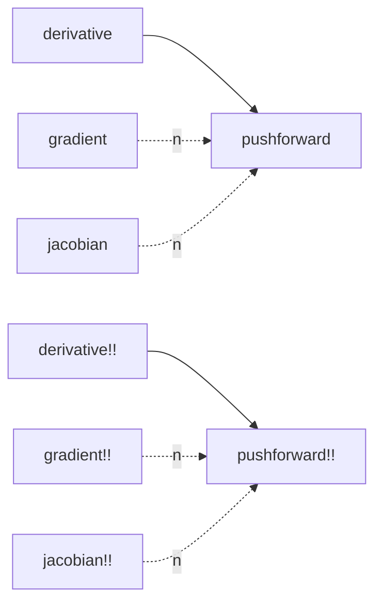
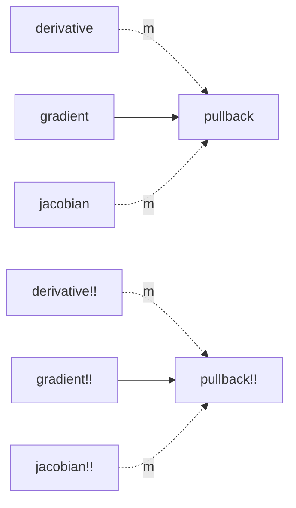

# For AD developers

## Backend requirements

To be usable with DifferentiationInterface.jl, an AD backend needs an object subtyping `ADTypes.AbstractADType`.
In addition, some operators must be defined:

| backend subtype                               | pushforward necessary | pullback necessary |
| --------------------------------------------- | --------------------- | ------------------ |
| `ADTypes.AbstractForwardMode`                 | yes                   | no                 |
| `ADTypes.AbstractFiniteDifferencesMode`       | yes                   | no                 |
| `ADTypes.AbstractReverseMode`                 | no                    | yes                |
| `ADTypes.AbstractSymbolicDifferentiationMode` | yes                   | yes                |

Every backend we support corresponds to a package extension of DifferentiationInterface.jl (located in the `ext` subfolder).
Advanced users are welcome to code more backends and submit pull requests!

## Fallback call structure

For simplicity, we remove `value_` in the operator names below.

!!! note "Edge labels"

    Full edges in the following graphs require a single call to the destination.
    Dotted edges require multiple calls to the destination, the number is indicated above.

### Forward mode, allocating functions

### Reverse mode, allocating functions

