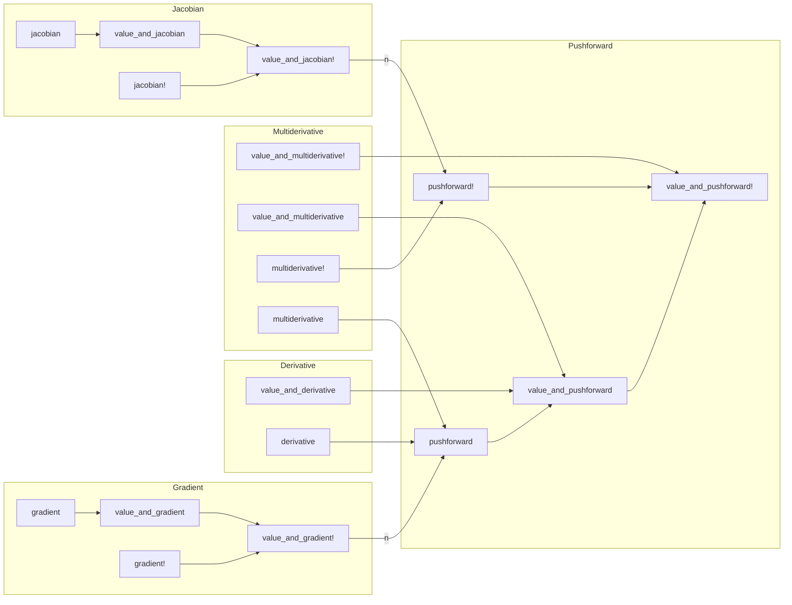
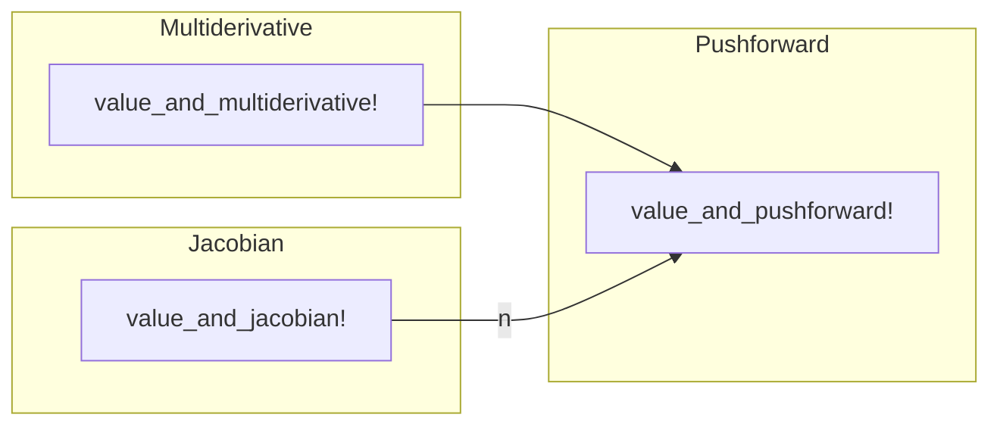
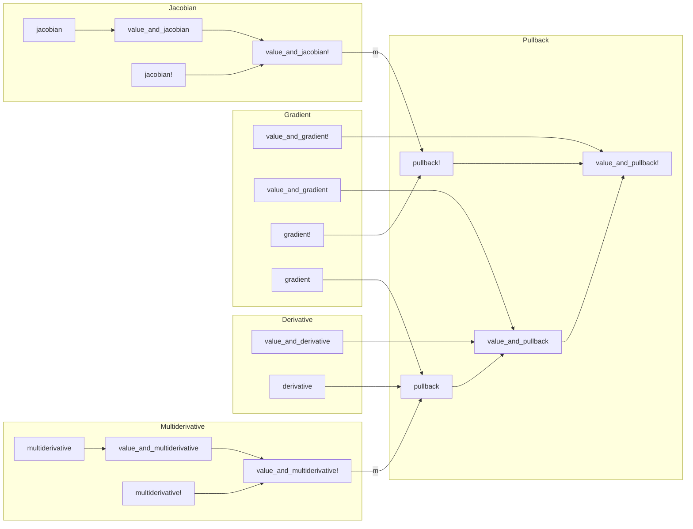
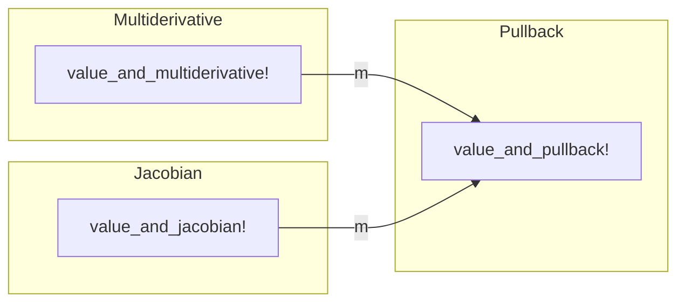
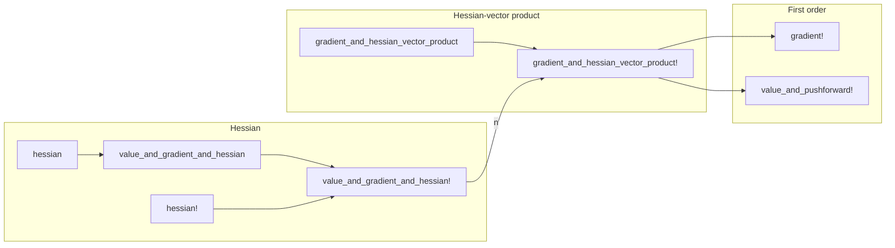

# For AD developers

## Backend requirements

Every [operator](@ref operators) can be implemented from either of these two primitives:

- the pushforward (in forward mode), computing a Jacobian-vector product
- the pullback (in reverse mode), computing a vector-Jacobian product

The only requirement for a backend is therefore to implement either [`value_and_pushforward!`](@ref) or [`value_and_pullback!`](@ref), from which the rest of the operators can be deduced.
We provide a standard series of fallbacks, but we leave it to each backend to redefine as many of the utilities as necessary to achieve optimal performance.

Every backend we support corresponds to a package extension of DifferentiationInterface.jl (located in the `ext` subfolder).
Advanced users are welcome to code more backends and submit pull requests!

## Fallback call structure

!!! note "Edge labels"

    Non-labeled edges in the following graphs correspond to single function calls.

    Edge labels correspond to the amount of function calls when applying operators to a function $f: \mathbb{R}^n \rightarrow \mathbb{R}^m$.

### Forward mode, allocating functions

### Forward mode, mutating functions

### Reverse mode, allocating functions

### Reverse mode, mutating functions

### Second order, scalar-valued functions

