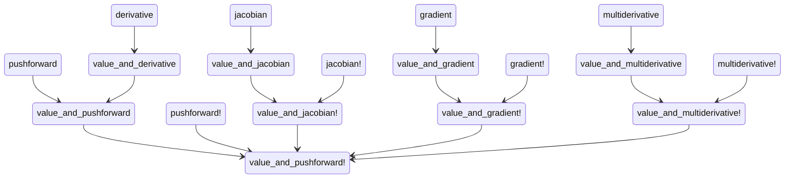
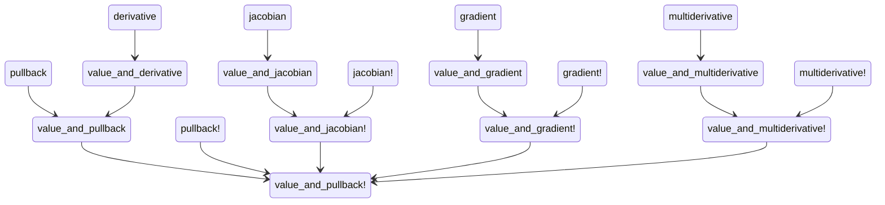

# Developer documentation

## Backend requirements

Every [operator](@ref operators) can be implemented from either of these two primitives:

- the pushforward (in forward mode), computing a Jacobian-vector product
- the pullback (in reverse mode), computing a vector-Jacobian product

The only requirement for a backend is therefore to implement either [`value_and_pushforward!`](@ref) or [`value_and_pullback!`](@ref), from which the rest of the operators can be deduced.
We provide a standard series of fallbacks, but we leave it to each backend to redefine as many of the utilities as necessary to achieve optimal performance.

Every backend we support corresponds to a package extension of DifferentiationInterface.jl (located in the `ext` subfolder).
Advanced users are welcome to code more backends and submit pull requests!

## Fallback call structure

### Forward mode 

### Reverse mode 
